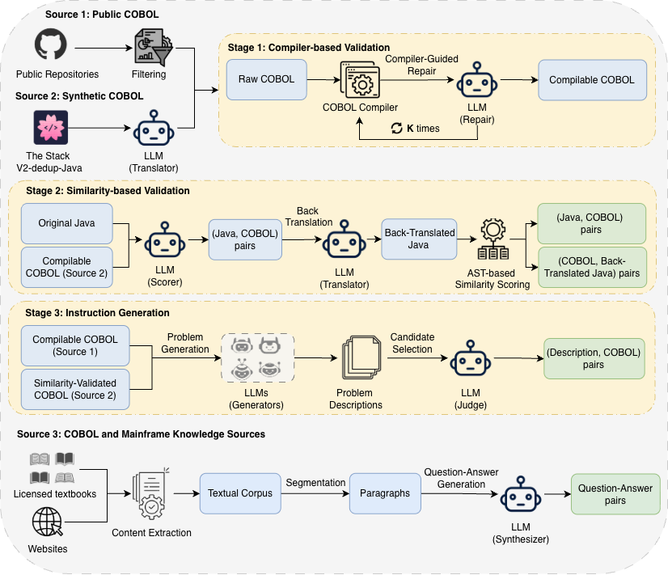

<div align="center">

# COBOL-Coder: Domain-Adapted Large Language Models for COBOL Code Generation and Translation

[](https://opensource.org/licenses/Apache-2.0)
[](https://arxiv.org/abs/2604.03986)
[](https://www.python.org/downloads/release/python-3100/)

</div>

## Table of Contents

- [Introduction](#introduction)
- [Data Augmentation Pipeline](#data-augmentation-pipeline)
- [Model Download](#model-download)
- [Evaluation Results](#evaluation-results)
  - [COBOL Code Generation](#cobol-code-generation)
  - [COBOL-Java Translation](#cobol-java-translation)
- [Getting Started](#getting-started)
  - [Installation](#installation)
  - [Training](#training)
  - [Inference](#inference)
  - [Evaluation](#evaluation)
- [COBOL-JavaTrans Benchmark](#cobol-javatrans-benchmark)
- [Repository Structure](#repository-structure)
- [Acknowledgements](#acknowledgements)
- [Citation](#citation)

## Introduction

**COBOL-Coder** is a family of domain-adapted LLMs specialized for COBOL code generation and bidirectional COBOL-Java code translation. Built on top of [Qwen2.5-Coder](https://huggingface.co/Qwen/Qwen2.5-Coder-14B-Instruct), COBOL-Coder addresses the critical gap in LLM capabilities for legacy programming languages.

COBOL remains a critical language for mainframe systems in banking, insurance, and government, yet existing LLMs struggle to generate and translate COBOL code correctly. COBOL-Coder bridges this gap through domain-specific data curation and fine-tuning.

Key highlights:

- **73.95% compilation success rate** and **49.33 Pass@1** on COBOLEval, compared to 41.8% and 16.4 for GPT-4o
- **34.93 Pass@1** on Java-to-COBOL translation, where all other LLMs (including GPT-4o) achieve near-zero scores
- The **only model** with non-trivial performance on COBOLCodeBench (26.09% CSR, 4.35 Pass@1)
- An **automated data augmentation pipeline** combining compiler-guided validation with multi-stage similarity-based filtering
- **COBOL-JavaTrans**, the first benchmark for bidirectional COBOL-Java translation

## Data Augmentation Pipeline

<div align="center">

</div>

We construct COBOL-specific training data through three complementary sources and a multi-stage validation pipeline:

**Source 1: Public COBOL Code from GitHub** - 40,829 unique COBOL files mined from public repositories, cleaned via MinHash deduplication, then validated through a compiler-based self-debugging loop (GnuCOBOL + LLM repair, K=3 iterations), yielding 31,492 compilable programs.

**Source 2: Synthetic COBOL via Code Translation** - Java programs from The Stack v2-dedup are translated to COBOL using GPT-4o, then validated through:
- *Stage 1: Compiler-based Validation* - Iterative compilation and LLM-guided repair
- *Stage 2: Similarity-based Validation* - LLM-based pair scoring and AST-based back-translation scoring with CodeBERTScore 

**Source 3: COBOL and Mainframe Knowledge Sources** - Licensed textbooks and technical websites, segmented and transformed into instruction-style QA pairs.

**Stage 3: Instruction Generation** - For both Source 1 and Source 2, multiple LLMs (GPT-4, GPT-4o-mini, GPT-oss-120B, CodeLlama-70B) generate candidate problem descriptions, with GPT-4o selecting the best via LLM-as-a-judge.

| Data Source | Instruction Format | Token Count | # Instances |
|---|---|---|---|
| GitHub Repositories | Description-Code | 38.4M | 31,492 |
| Synthetic COBOL | COBOL-Java | 206M | 173,042 |
| Synthetic COBOL | Java-COBOL | 170M | 173,042 |
| Synthetic COBOL | Description-Code | 230M | 172,759 |
| COBOL Knowledge Sources | Question-Answer | 241M | 153,415 |

## Model Download

| Model | Base Model | Parameters | Download |
|---|---|---|---|
| COBOL-Coder-7B | Qwen2.5-Coder-7B-Instruct | 7B | Coming soon |
| COBOL-Coder-14B | Qwen2.5-Coder-14B-Instruct | 14B | Coming soon |

## Evaluation Results

All evaluations are performed in a **zero-shot** setting with temperature=0.0. Results are averaged over three runs.

### COBOL Code Generation

Performance on COBOLEval (146 tasks) and COBOLCodeBench (46 tasks). **Bold** = best in block; **Bold + Underline** = overall best.

| Model | COBOLEval CSR | COBOLEval Pass@1 | COBOLCodeBench CSR | COBOLCodeBench Pass@1 |
|---|---|---|---|---|
| DeepSeek-Coder 6.7B | 14.98 | 1.37 | 0 | 0 |
| CodeGemma 7B | 0 | 0 | 0 | 0 |
| CodeLlama 7B | 0 | 0 | 0 | 0 |
| Mainframer 7B | 69.17 | 6.16 | 0 | 0 |
| Qwen2.5-Coder 7B | 10.27 | 0.68 | 0 | 0 |
| DeepSeek-R1-Distill-Qwen-7B | 0 | 0 | 0 | 0 |
| StarCoder2 7B | 0 | 0 | 0 | 0 |
| **COBOL-Coder-7B (Ours)** | **73.80** | **44.70** | **13.04** | 0 |
| CodeLlama 13B | 3.40 | 0.68 | 0 | 0 |
| Mainframer 13B | 62.24 | 11.64 | 0 | 0 |
| Qwen2.5-Coder 14B | 12.32 | 2.74 | 0 | 0 |
| DeepSeek-R1-Distill-Qwen-14B | 0 | 0 | 0 | 0 |
| StarCoder2 15B | 0 | 0 | 0 | 0 |
| DeepSeekCoder-V2 16B | 10.27 | 1.37 | 0 | 0 |
| **COBOL-Coder-14B (Ours)** | **_73.95_** | **_49.33_** | **_26.09_** | **_4.35_** |
| GPT-oss-120B | 19.17 | 4.11 | 17.39 | 2.17 |
| GPT-4 | 24.12 | 15.75 | 13.04 | 0 |
| GPT-4o | 41.80 | 16.40 | 13.04 | 0 |

### COBOL-Java Translation

Performance on the COBOL-JavaTrans benchmark (143 pairs). C2J = COBOL-to-Java, J2C = Java-to-COBOL.

| Model | C2J CSR | C2J Pass@1 | J2C CSR | J2C Pass@1 |
|---|---|---|---|---|
| DeepSeek-Coder 6.7B | 88.11 | 63.64 | 0 | 0 |
| CodeGemma 7B | 76.22 | 48.25 | 0 | 0 |
| CodeLlama 7B | 76.92 | 29.37 | 0 | 0 |
| Mainframer 7B | 5.59 | 1.39 | 0 | 0 |
| Qwen2.5-Coder 7B | 14.68 | 10.47 | 0 | 0 |
| DeepSeek-R1-Distill-Qwen-7B | 83.21 | 55.94 | 0 | 0 |
| StarCoder2 7B | 0 | 0 | 0 | 0 |
| **COBOL-Coder-7B (Ours)** | **97.90** | **81.81** | **63.64** | **27.27** |
| CodeLlama 13B | 83.21 | 48.95 | 0 | 0 |
| Mainframer 13B | 62.23 | 37.06 | 0 | 0 |
| Qwen2.5-Coder 14B | 8.39 | 3.50 | 0 | 0 |
| DeepSeek-R1-Distill-Qwen-14B | 70.63 | 60.13 | 0 | 0 |
| StarCoder2 15B | 39.36 | 18.88 | 0 | 0 |
| DeepSeekCoder-V2 16B | 95.10 | 75.52 | 0 | 0 |
| **COBOL-Coder-14B (Ours)** | **97.90** | **83.91** | **_72.03_** | **_34.93_** |
| GPT-oss-120B | **_98.60_** | **_89.51_** | 5.38 | 3.93 |
| GPT-4 | 94.40 | 72.73 | 5.45 | 1.73 |
| GPT-4o | 97.20 | 85.31 | 4.36 | 2.18 |


## Getting Started

### Installation

```bash
conda create -n cobol-coder python=3.10 && conda activate cobol-coder

git clone https://github.com/COBOL-Coder/COBOL-Coder.git
cd COBOL-Coder
pip install -r requirements.txt
```

For evaluation, you also need:
- [GnuCOBOL](https://gnucobol.sourceforge.io/) compiler (`cobc`, version 2.0.0) for COBOL compilation
- Java JDK (`javac`, version 17.0.18) for Java compilation (C2J evaluation)

### Training

Fine-tune Qwen2.5-Coder on COBOL-specific data using DeepSpeed ZeRO-3:

```bash
bash sft.sh
```


### Inference

Generate COBOL code completions for the COBOLEval benchmark:

```bash
python evaluation/generate_coboleval.py \
    --model_path path/to/COBOL-Coder-14B \
    --output_dir evaluation/output \
    --data_path evaluation/data/CobolEval.jsonl
```

Generate translations for COBOL-JavaTrans:

```bash
# COBOL-to-Java
python evaluation/generate_cobol_javatrans.py \
    --model_path path/to/COBOL-Coder-14B \
    --direction c2j \
    --output_dir evaluation/output

# Java-to-COBOL
python evaluation/generate_cobol_javatrans.py \
    --model_path path/to/COBOL-Coder-14B \
    --direction j2c \
    --output_dir evaluation/output
```

### Evaluation

Evaluate COBOL code generation (COBOLEval) and Java-to-COBOL translation (J2C):

```bash
python evaluation/evaluate_coboleval.py \
    --samples_file evaluation/output/<model>_coboleval_samples.jsonl \
    --data_path evaluation/data/CobolEval.jsonl
```

Evaluate COBOL-to-Java translation (C2J):

```bash
python evaluation/evaluate_translation_c2j.py \
    --samples_file evaluation/output/<model>_javatrans_c2j.jsonl \
    --data_path evaluation/data/COBOL-JavaTrans.jsonl
```

Example output files from COBOL-Coder are provided in `evaluation/output/`.

## COBOL-JavaTrans Benchmark

**COBOL-JavaTrans** is the first benchmark specifically designed for bidirectional COBOL-Java code translation, derived from HumanEval. It contains 143 task pairs (out of 164 HumanEval tasks) with both COBOL and Java implementations, along with test cases for both languages. Tasks were constructed using a vibe-coding-inspired workflow, with all programs manually reviewed and validated for compilability and functional correctness.

| Benchmark | Source Language | Task Category | Size |
|---|---|---|---|
| COBOLEval | Python | Code Generation | 146 problems |
| COBOLCodeBench | Python | Code Generation | 46 problems |
| COBOL-JavaTrans (Ours) | COBOL, Java | C2J, J2C Translation | 143 pairs |

The benchmark data is included in `evaluation/data/`.

## Repository Structure

```
COBOL-Coder/
├── src/                          # LLaMA-Factory source (training framework)
├── evaluation/
│   ├── data/                     # Benchmark datasets
│   │   ├── CobolEval.jsonl
│   │   └── COBOL-JavaTrans.jsonl
│   ├── output/                   # Example outputs from COBOL-Coder
│   ├── generate_coboleval.py     # Inference for COBOLEval
│   ├── generate_cobol_javatrans.py  # Inference for COBOL-JavaTrans
│   ├── evaluate_coboleval.py     # Evaluation for COBOL code (CSR + Pass@1)
│   ├── evaluate_translation_c2j.py  # Evaluation for C2J translation
│   └── utils.py                  # Shared utilities
├── examples/                     # DeepSpeed configs and training examples
├── scripts/                      # Utility scripts
├── docker/                       # Docker configurations (CUDA, NPU, ROCm)
├── sft.sh                        # Training launch script
├── requirements.txt              # Python dependencies
└── cobol_reserved_words.txt      # COBOL vocabulary for tokenizer
```

## Acknowledgements

- The authors gratefully acknowledge the support and resources provided by Dr. Phong Xuan Nguyen of the FPT Software AI Center, Vietnam
- This codebase is built on [LLaMA-Factory](https://github.com/hiyouga/LLaMA-Factory) for efficient fine-tuning
- COBOLEval benchmark by [BloopAI](https://bloop.ai/blog/evaluating-llms-on-cobol)
- COBOLCodeBench by [Kumar (2025)](https://huggingface.co/datasets/harshini-kumar/CobolCodeBench)
- Base model: [Qwen2.5-Coder](https://github.com/QwenLM/Qwen2.5-Coder) by the Qwen team

## Citation

If you find this work useful, please cite our paper:

```bibtex
@article{dau2026cobol,
  title={COBOL-Coder: Domain-Adapted Large Language Models for COBOL Code Generation and Translation},
  author={Dau, Anh TV and Tan, Shin Hwei and Yang, Jinqiu and Bui, Nghi DQ and Nguyen, Anh Tuan},
  journal={arXiv preprint arXiv:2604.03986},
  year={2026}
}
}
```

For our earlier work on mainframe modernization:

```bibtex
@article{dau2024xmainframe,
  title={XMainframe: A Large Language Model for Mainframe Modernization},
  author={Dau, Anh TV and Dao, Hieu Trung and Nguyen, Anh Tuan and Tran, Hieu Trung and Nguyen, Phong X and Bui, Nghi DQ},
  journal={arXiv preprint arXiv:2408.04660},
  year={2024}
}
```
